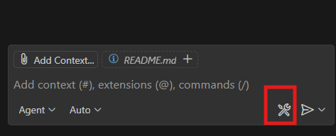

Steps to setup and run
1) Install all dependecies by this command
uv pip install -r pyproject.toml
2) run mcp server using below commands
fastmcp run githubMCP.py testmcp.py
3) goto .vscode/mcp.json and start server
4) goto Copilot Chat and turn into agent mode and select these mcp server from tools by clicking on tools

Start your giving prompt
for getting Addtition give command like: - give me addition of 45.7 and 67.5
for getting github repository information, give command like 
give me my github repository information
then give the detail like owner/repo/github_token like below 
OWNER (your GitHub username):
REPO (your repository name):
GITHUB_TOKEN (your personal access token):

Enjoy happy coding!